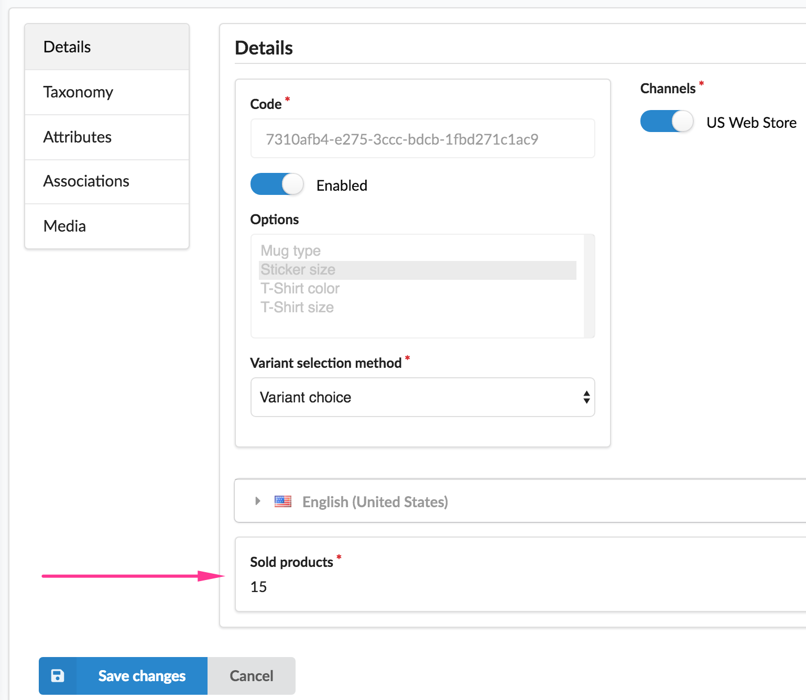

# MukhinSyliusItemsSoldPlugin

Sylius Plugin to display items sold on every Product/ProductVariant details admin page



## Install

### Add plugin to composer.json

```bash
composer require igormukhingmailcom/sylius-items-sold-plugin
```

### Register plugin at AppKernel.php

```php
# app/AppKernel.php

final class AppKernel extends Kernel
{
    public function registerBundles(): array
    {
        return array_merge(parent::registerBundles(), [
            // ...
            new \Mukhin\SyliusItemsSoldPlugin\MukhinSyliusItemsSoldPlugin(),
        ]);
    }
}
```

### Add routing

```yaml
# app/config/routing.yml
mukhin_sylius_items_sold_plugin_admin:
    resource: "@MukhinSyliusItemsSoldPlugin/Resources/config/admin_routing.yml"
    prefix: /admin

```

### Configure plugin (optional)

You can omit this step as far as plugin works even without configuration.
In that case result will count carts/orders in any (checkout/payment/shipment) states 
without any interval limitation and will not be cached.

But lets suppose we need to:
- See how much times every item was sold last 14 days
- Cache that values for 30 mins (1800 seconds) to decrease server load a bit 
- We don't want to count orders in states other than in *payed* and *shipped*

```yaml
# app/config/config.yml
services:
    app.mukhin_sylius_items_sold.cache:
        class: Symfony\Component\Cache\Simple\FilesystemCache
        arguments:
            - ''
            - 0
            - "%kernel.cache_dir%/items-sold"

mukhin_sylius_items_sold:
    cache:
        service: 'app.mukhin_sylius_items_sold.cache'
        ttl: 1800
    interval: 14
    payment_states:
        - paid
    shipping_states:
        - shipped
```

Tips:

- Don't forget to clean cache after changing `interval` parameter.
- Don't specify `interval` if you wish to count even items added to carts 
  (as far as cart doesn't have order date at `checkoutCompletedAt` field)
- Discover `Mukhin\SyliusItemsSoldPlugin\DependencyInjection\Configuration`
  for more info about config options
  
# (Manually) Test plugin

- Run application:
  (by default application have default config at `dev` environment
  and example config from `Configure plugin` step at `prod` environment)
  
    ```bash
    SYMFONY_ENV=dev
    cd tests/Application && \
        yarn install && \
        yarn run gulp && \
        bin/console assets:install web -e $SYMFONY_ENV && \
        bin/console doctrine:database:create -e $SYMFONY_ENV && \
        bin/console doctrine:schema:create -e $SYMFONY_ENV && \
        bin/console sylius:fixtures:load -e $SYMFONY_ENV && \
        bin/console server:run -d web -e $SYMFONY_ENV
    ```

- Log in at `http://localhost:8000/admin`
  with Sylius demo credentials:
  
  ```
  Login: sylius@example.com
  Password: sylius 
  ```
  
- Go to any product edit page like 
  `http://localhost:8000/admin/products/1`

- Or to product variant page like
  `http://localhost:8000/admin/products/1/variants/1/edit`

- See how much that item was ordered (or even added to cart depending on config)
